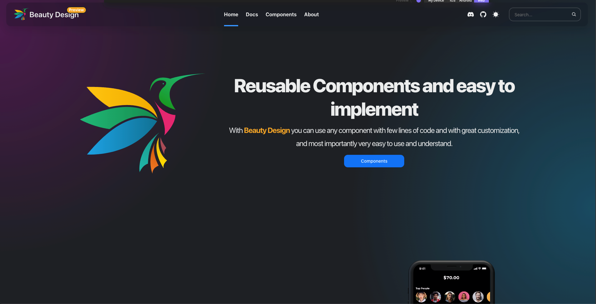

# @redshank/native

The objective of this project is to create a complete and advanced framework such as Antd for the web, I want to be able
to offer a set of reusable components that are native and beautiful in such a way that we all love to use it in our
projects

# Documentation

[Documentation](https://www.redshank.app) under construction, launch scheduled for November 30, 2022.

## Installation

```sh
npm install @redshank/native
```

# Usage

Make sure you have react-native>=0.65.0

## Documentation

Documentation [here](https://redshank.app)



## Code Example

```js
import {
  Button,
  Space,
  Text,
  ThemeProvider,
} from '@redshank/native';

export default function App() {
  // automic dark mode
  return (
    <ThemeProvider>
      <ScrollView contentContainerStyle={styles.view}>
        <View style={styles.container}>
          <View>
            <Text>Buttons</Text>
            <Text level={4}>Default buttons</Text>
            <Space justify="center">
              <Button>Primary</Button>
              <Button color="success">Success</Button>
              <Button type="link" color="warning">
                Warning
              </Button>
              <Button type="outline" color="error">
                Error
              </Button>
            </Space>
          </View>
          <View>
            <Text level={4}>Circle buttons</Text>
            <Space justify="center">
              <Button shape="circle">Primary</Button>
              <Button shape="circle" color="success">
                Success
              </Button>
              <Button type="link" shape="circle" color="warning">
                Warning
              </Button>
              <Button type="outline" shape="circle" color="error">
                Error
              </Button>
            </Space>
          </View>
          <View>
            <Text level={4}>Custom color buttons</Text>
            <Space justify="center">
              <Button color="magenta">Magenta</Button>
              <Button color="orangered">Orangered</Button>
              <Button color="green">Green</Button>
              <Button color="purple">Purple</Button>
            </Space>
          </View>
        </View>
      </ScrollView>
    </ThemeProvider>
  );
}
```

## Contributing

See the [contributing guide](CONTRIBUTING.md) to learn how to contribute to the repository and the development workflow.

## License

MIT
